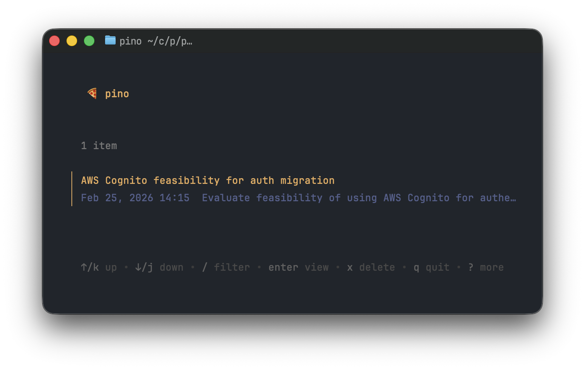

# pino

A TUI app for saving and browsing prompts and plans. Built with [Bubble Tea](https://github.com/charmbracelet/bubbletea).

Pinos are stored as individual markdown files in `~/.pino/`.

## Why

Sometimes you have an idea of how to do something — you write a prompt, maybe get a plan back — but you're not ready to act on it yet. You don't want to lose it either. Pino is the safe place to stash those prompts and plans so you can come back to them later.



## Install

```bash
go install github.com/sonereker/pino@latest
```

Or build from source:

```bash
git clone git@github.com:sonereker/pino.git
cd pino
go build -o pino
```

## Usage

### TUI

```bash
pino
```

Opens the interactive TUI. Navigate with `j/k`, press `enter` to view details, `/` to filter, `x` to delete, `esc` to go back, `q` to quit.

### Push a pino

```bash
pino push --summary "Refactor auth flow" --prompt "Help me refactor..." --plan "1. Extract middleware..."
```

`--plan` is optional.

### List all pinos

```bash
pino list
```

Outputs JSON to stdout.

### Search pinos

```bash
pino search "auth"
```

Case-insensitive search across summary, prompt, and plan. Outputs JSON.

### Delete a pino

```bash
pino delete 2026-02-25_refactor-auth-flow
```

## Storage format

Each pino is a markdown file in `~/.pino/`:

```
~/.pino/2026-02-25_refactor-auth-flow.md
```

```markdown
# Refactor auth flow

> 2026-02-25 14:30

## Prompt

Help me refactor the authentication flow to use middleware...

## Plan

1. Extract auth logic into middleware
2. Add token validation
3. Update routes
```
